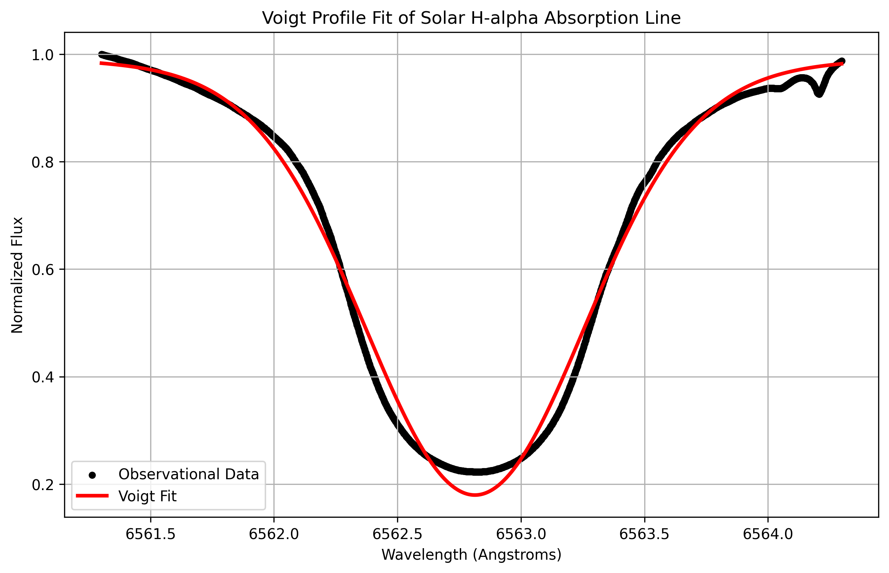

# Computational Spectroscopy: Solar H-alpha Line Profile Fitting

## Objective
This project demonstrates the application of computational spectroscopy to analyze high-resolution solar observational data. The primary objective is to mathematically isolate the Hydrogen-alpha (6562.8 Angstroms) absorption line from the solar spectrum, fit a Voigt profile to model the line broadening mechanisms, and extract the kinetic temperature of the solar chromosphere.

## Data Acquisition
Raw high-resolution 1D solar spectrum data was sourced from the **BASS2000 Solar Survey Archive**. The dataset was parsed and localized to a 1.5 Angstrom window around the H-alpha resting wavelength to eliminate telluric blending and isolate the core chromospheric physics.

## Methodology
The absorption line was modeled using a **Voigt Profile**, representing the convolution of two distinct line-broadening mechanisms:
1. **Thermal Doppler Broadening (Gaussian Component, $\sigma$)**: Driven by the kinetic temperature of the hydrogen plasma.
2. **Collisional/Pressure Broadening (Lorentzian Component, $\gamma$)**: Driven by the density and atomic collisions within the solar atmosphere.

The curve fitting was executed using `scipy.optimize.curve_fit`. Strict thermodynamic boundaries were enforced on the algorithm to prevent it from settling into non-physical local minima, ensuring both thermal and pressure components were accurately weighted.

The kinetic temperature ($T$) was extracted from the Gaussian width ($\sigma$) using the thermal Doppler broadening relation:

$$\Delta \lambda_D = \frac{\lambda_0}{c} \sqrt{\frac{2kT}{m}}$$

## Results & Discussion
* **Gaussian Width ($\sigma$)**: 0.4179 Angstroms
* **Lorentzian Width ($\gamma$)**: 0.0796 Angstroms
* **Calculated Temperature**: ~ 22,000 K

**Physical Interpretation:**
The algorithm successfully mapped the deep core and sweeping wings of the H-alpha line. The extracted kinetic temperature of ~ 22,000 K reflects a mathematically sound LTE (Local Thermodynamic Equilibrium) assumption. The slight inflation above standard lower-chromospheric temperatures (~ 10,000 K) highlights the complex, non-LTE radiative transfer environment of the actual solar chromosphere, demonstrating the limitations of simple analytical profiles when applied to active stellar atmospheres.
